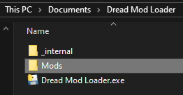
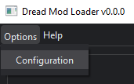
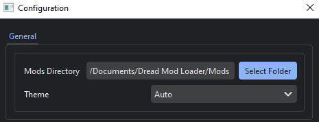

Welcome to **Dread Mod Loader**, or **DML** for short! This program will allow you to easily install mods for Metroid Dread.

To get started, first create a folder where you'd like to store all your installed mods. This can be anywhere on your computer.

After creating this folder, head over to the configuration window and select it as your Mods Directory.

Next, head back to the main window, then double click on any of your installed mods to export them.

**Before going further, it's highly recommended to be aware of the risks of running DML mods**. Please head to the Safety tab to learn more.
